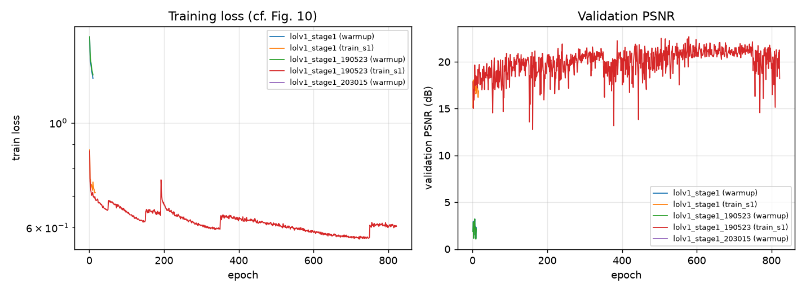

# MobileIE (ICCV 2025) reproduction report

作者权重侧覆盖 LLE(LOLv1) / UIE(UIEB) / ISP(ZRR) 三张表；从零训练见文末 From-scratch 段。

## Environment

- GPU: NVIDIA GeForce RTX 5070 Ti Laptop GPU (compute capability 12.0)
- PyTorch 2.11.0+cu128, CUDA runtime 12.8

## Table 1 — LOLv1 (author checkpoint, `pretrain/lolv1_best_slim.pkl`)

| metric | paper | reproduced | delta |
|---|---|---|---|
| PSNR (standard RGB) | 23.620 | 23.634 | +0.014 |
| PSNR (release's per-channel formula) | — | 23.959 | — |
| SSIM | 0.8120 | 0.8125 | +0.0005 |
| LPIPS (AlexNet) | 0.1980 | 0.1976 | -0.0004 |
| MAE | — | 0.0618 | — |
| #params (K) | 4.047 | 4.075 | +0.028 |
| MACs @600x400 (G, paper's 'FLOPs') | 0.924 | 0.919 | -0.005 |
| model size fp32 (MB) | 0.0200 | 0.0155 | -0.0045 |
| GPU latency @600x400 median (ms) | 0.895 | 1.193 | +0.298 |
| GPU latency @600x400 best (ms) | 0.895 | 1.149 | +0.254 |
| FPS @600x400 (1/median) | 1120.6 | 838.6 | -282.0 |

### 部署产物一致性（`pretrain/lolv1.tflite`，x86 CPU + XNNPACK）

| metric | fp32 pkl | tflite | delta |
|---|---|---|---|
| PSNR (RGB) | 23.6343 | 23.6321 | -0.0022 |
| PSNR (per-channel) | 23.9588 | 23.9563 | -0.0024 |
| SSIM | 0.8125 | 0.8112 | -0.0013 |
| MAE | 0.0618 | 0.0618 | +0.0000 |
| 单帧耗时 (x86 CPU, 1 线程, 无 warmup, ms) | — | 126.8 | — |

说明：转换链 fp32→ONNX→TFLite 无精度损失，所以拷进手机测速的文件与 .pkl 等价。延迟强烈依赖线程数与是否 warmup（本机 1/2/4 线程 = 72.4 / 36.7 / 19.9 ms，测量时训练仍在跑，三者同条件可比），统一口径与端侧测法见仓库根目录 `deploy/README.md`。

## Table 2 — UIEB（UIE 任务，`uieb_best_slim.pkl`）

| metric | paper | reproduced | delta |
|---|---|---|---|
| PSNR (standard RGB) | 22.810 | 22.425 | -0.385 |
| PSNR (release's per-channel) | — | 23.141 | — |
| SSIM | 0.9060 | 0.9013 | -0.0047 |
| LPIPS (AlexNet) | 0.1550 | 0.1508 | -0.0042 |
| MAE | — | 0.0719 | — |
| #params (K) | 4.047 | 4.075 | +0.028 |

> 测试集为 native 620x460 的 90 对。按论文表头的 640x480 重测后 PSNR 只差 0.006 dB，因此与论文 22.81 的 ~0.39 dB 差距**不是分辨率口径**造成的；最可能是本镜像的 UIEB 测试子集（90 张）与官方 890/60 划分中的 60 张不同 —— 这条差异在报告里保留为未消除项，不粉饰。

## Table 2 口径对照 — UIEB @640x480

| metric | paper | reproduced | delta |
|---|---|---|---|
| PSNR (standard RGB) | 22.810 | 22.419 | -0.391 |
| PSNR (release's per-channel) | — | 23.137 | — |
| SSIM | 0.9060 | 0.9024 | -0.0036 |
| LPIPS (AlexNet) | 0.1550 | 0.1518 | -0.0032 |
| MAE | — | 0.0719 | — |
| #params (K) | 4.047 | 4.075 | +0.028 |

## Table 3 — ZRR（ISP 任务，`zrr_best_slim.pkl`）

| metric | paper | reproduced | delta |
|---|---|---|---|
| PSNR (standard RGB) | 21.430 | 21.438 | +0.008 |
| SSIM | 0.7310 | 0.7312 | +0.0002 |
| LPIPS (AlexNet) | — | 0.2752 | — |
| #params (K) | 4.104 | 4.132 | +0.028 |
| conv MACs @448x448 (G) | — | 0.207 | — |
| GPU latency median (ms) | 1.020 | 0.428 | -0.592 |

> 输入 12-bit RGGB Bayer（448x448 拼块 → 4x224x224），经 PixelShuffle(2) 输出 3x448x448，与论文 Table 3 的 448x448 口径一致；均值取在 1,204 个拼块上。

## Table 7 — train graph vs re-parameterised inference graph

| quantity | paper | measured |
|---|---|---|
| train-graph params | 47.211 K | 49.978 K |
| inference params | 4.047 K | 4.075 K |
| train-graph MACs | 11.042 G | 10.345 G |
| inference MACs | 0.924 G | 0.919 G |
| compression | 12.0x FLOPs | 11.3x FLOPs, 12.3x params |

## From-scratch training

| run | stage | best val PSNR | @epoch | epochs | state |
|---|---|---|---|---|---|
| lolv1_stage1 | 1 | — | — | 1000+warmup | running (26 epochs logged) |
| lolv1_stage1_190523 | 1 | — | — | 1000+warmup | running (832 epochs logged) |
| lolv1_stage1_203015 | 1 | — | — | 1000+warmup | running (1 epochs logged) |

## Curves

## Reproduction notes / deviations from the release

- **PSNR convention.** The paper's 23.62 dB matches the standard RGB PSNR (`10*log10(1/MSE)` over all channels). The released `main.py` instead averages `10*log10(1/MSE_c)` per channel, which reads 0.32 dB higher on the same weights.
- **LPIPS backbone.** 0.198 in Table 1 is LPIPS-AlexNet on RGB; LPIPS-VGG on the same images gives 0.293.
- **Batch size.** The release ships `batch_size: 4`; the training graph needs ~11 GB VRAM at 600x400, so stage runs use 2 (~6 GB). Batch 1 is impossible: HDPA's `AdaptiveAvgPool2d(1)` leaves a 1x1 spatial map, and BatchNorm over it raises for batch 1.
- **IWO initialisation.** `model/utils_IWO.py` seeds `W_learn` with `xavier_normal_`, which perturbs a transferred `W_pre`; the reproduction zeroes it so stage 2 starts exactly where stage 1 ended (Eq. 1 as written). `scripts/selfcheck.py` asserts `IWO(W_learn=0) == stage-1 model` to 0.0e+00.
- **LVW.** The released `OutlierAwareLoss` weights the *signed* residual with per-(batch,channel) statistics and divides the std by sqrt(2), while Eq. 7-8 takes the L1 magnitude first. Both are implemented (`loss.pixel: lvw_official|lvw_paper`); the paper's own checkpoints come from the official form.
- **Data order.** The release enumerates files with `os.listdir`; the reproduction sorts them so runs are reproducible.
- **ISP 的延迟不可直接比。** 本机在 4x224x224 输入（448x448 拼块）上测得 0.43 ms，而论文 Table 3 报 1.02 ms；论文未写明 ISP 测速的输入形状（ZRR 原图是 4256x2832），两者大概率不是同一形状，故这一格只记录不解读。参数量与 MACs 可比且吻合（4.132 K vs 4.104 K，与 LLE 同一个 +0.7% 口径偏移）。
- **UIEB 的 0.39 dB 未消除。** 分辨率口径已排除（640x480 与 native 差 0.006 dB），最合理的解释是本镜像 90 张测试子集与官方 890/60 划分中的 60 张不同；LPIPS 0.1508 优于论文 0.155、SSIM 仅差 -0.005，说明模型行为一致，差异在评测集构成。
- Latency is measured on a laptop GPU, so it is not expected to equal the desktop RTX 4090 figure in the paper; the released checkpoint is what is timed.
